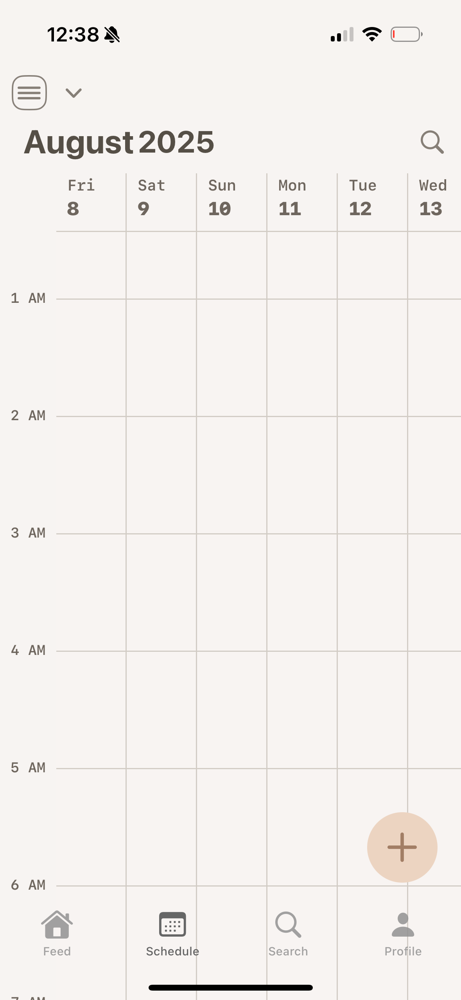
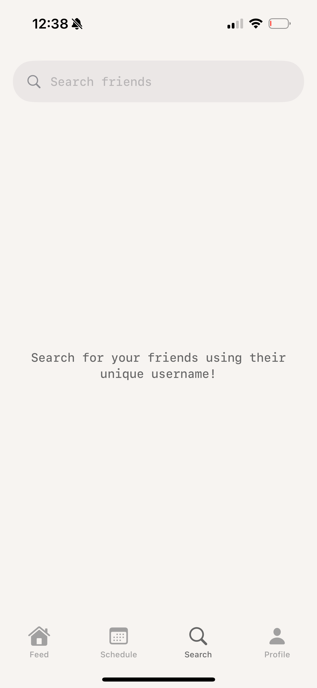
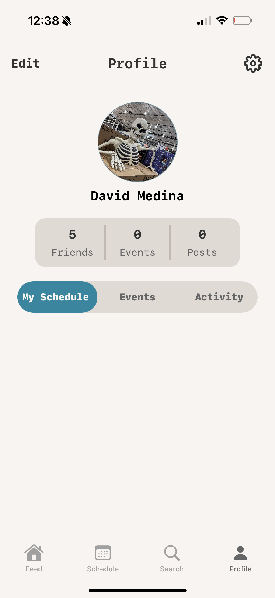
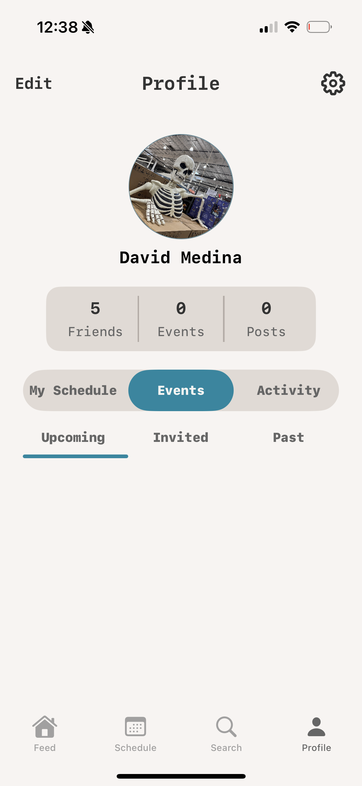
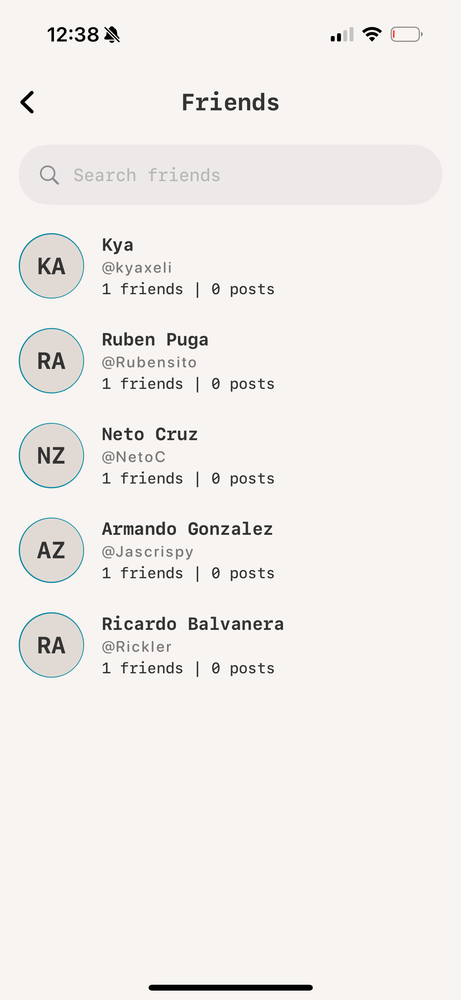
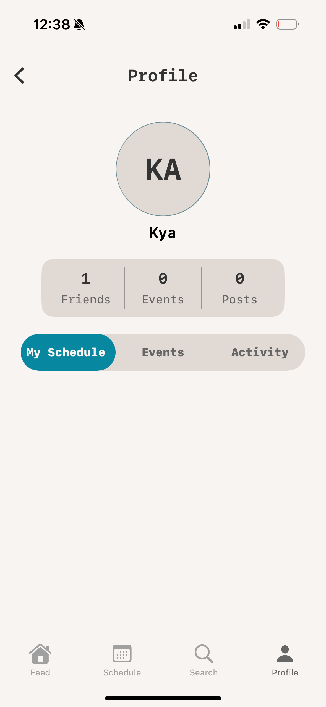
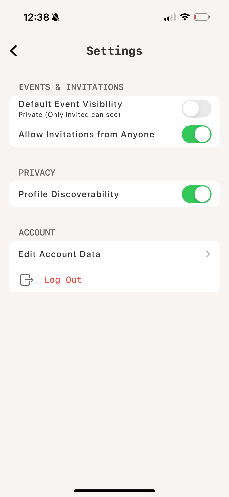
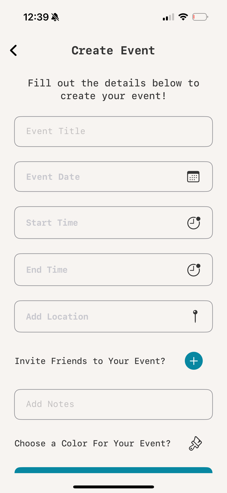
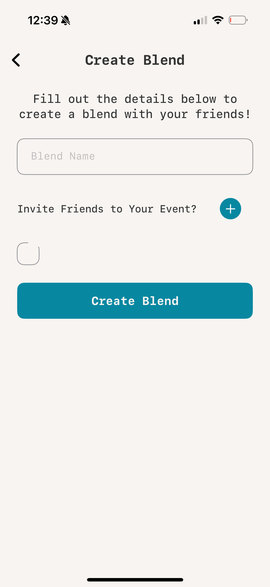

Original App Design Project - README Template
===

# Schedl

## Table of Contents

1. [Overview](#Overview)
2. [Product Spec](#Product-Spec)
3. [Wireframes](#Wireframes)
4. [Schema](#Schema)

## Overview

### Description

Schedl is a social calendar application that blends traditional calendar apps with a social aspect by allowing you to create individual or collaborative events where you can invite your friends or other users on the app. Within Schedl, friends will be able to view each other's schedules and events (based on what each user decides to show/hide). A big feature of Schedl allows for users to create 'Blends' with their friends so that they can view each other's schedules all under one and can then generate meeting times based on this or even just decide on a time for all of them to meet. When a user creates an event in a Blend, the invite is immediately added to all user's schedules given that the time slot is free. Lastly, the biggest feature of Schedl allows for users to create posts based on their events. If a user decides they want to share a photo during or after an event, they can simply go to create a post and can then pick from their most recent events to create a post based on it. This post will then be visible to only their friends. The idea of Schedl is not to go viral or gain tons of followers; it's purpose is to allow users to have a place where they can easily relate and recall their memories by viewing past events and seeing their uploaded photos.

### App Evaluation

[Evaluation of your app across the following attributes]
- **Category:** Productivitiy
- **Mobile:** Schedl is well-suited for a mobile application given that nobody wants to load up a browser to go view their schedule.
- **Story:** For the most part, I think users can find a liking to this app given it's unique aesthetic and overall value. 
- **Market:** Schedl is not an entirely original concept as there's been a handful of other apps with a similar idea, but Schedl is quite different since it doesn't go 'all-in' on the social aspect by allowing users to use the app entirely without ever adding any friends
- **Habit:** Not everybody even follows or keeps up with a schedule, but there is definitely a market for those who do and I'd say it's not 'niche' but also not overly large. In terms of value, I think Schedl provides just as much as other exisitng calendar applications while also giving users the ability to easily interact with others by sending event invites directly in the app. If the app attracts the younger generation, I can definitely see the posts feature (being as it's much more organic than say Instagram) will be a big selling point for users to interact with what their friends are doing at any given time. Worst case, Schedl just becomes a glorified calendar application
- **Scope:** I think Schedl won't benefit from not being complete. Without it's unique features like Blends or posts, it's just another calendar application that looks pretty. With the features that set it apart, Schedl can genuinely stand out in an emerging market that appears to value organic content from 'real' people (not bots like Instagram, Facebook, etc.)

## Product Spec

### 1. User Stories (Required and Optional)

**Required Must-have Stories**

* As a new user, I should be able to create an account.
* As a user, I should be able to log in and create a schedule.
* As a user, I should be able to view my new schedule and create an event.
* As a user, I should be able to view, edit, and delete my event.
* As a user, I should be able to see my events in my profile.
* As a user, I should be able to see my friends profile page's and see their schedules.
* As a user, I should be able to create a post from a list of past/occuring events.
* As a user, I should be able to view, edit, and delete my posts.
* As a user, I should be able to view my friends posts.
* As a user, I should be able to search for any other users on the application and view their profile.

**Optional Nice-to-have Stories**

* As a user, I should be able to create a Blend with my friends
* As a user, I should be able to view any Blend and see both my friends and I's events.

### 2. Screen Archetypes

- [ ] Feed
* As a user, I should be able to create a post from a list of past/occuring events.
* As a user, I should be able to view, edit, and delete my posts.
* As a user, I should be able to view my friends posts.
- [ ] Schedule
* As a user, I should be able to log in and create a schedule.
* As a user, I should be able to view my new schedule and create an event.
* As a user, I should be able to view, edit, and delete my event.
- [ ]  Search
* As a user, I should be able to search for any other users on the application and view their profile.
- [ ] Profile
* As a user, I should be able to see my events in my profile.
* As a user, I should be able to see my friends profile page's and see their schedules.

### 3. Navigation

**Tab Navigation** (Tab to Screen)

* Feed
* Schedule
* Search
* Profile

**Flow Navigation** (Screen to Screen)

- [ ] Feed
* Friend Profile
* Event Details
- [ ] Schedule
* Event Details
* Create Event
* Create Blend
* Create Schedule
* Edit Event
* Search for Events
- [ ] Search
* Profile
* Event Details
- [ ] Profile
* Event Details
* Settings
* Friends
* Friends Profiles
* Edit Event
* Schedule Page

## Wireframes

### [BONUS] Digital Wireframes & Mockups

### [BONUS] Interactive Prototype

## Schema 

[This section will be completed in Unit 9]

### Models

[Add table of models]

### Networking

- [Add list of network requests by screen ]
- [Create basic snippets for each Parse network request]
- [OPTIONAL: List endpoints if using existing API such as Yelp]
